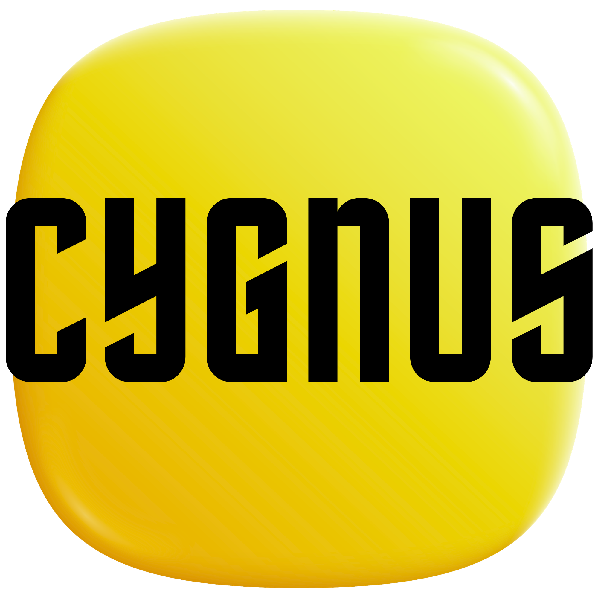

<div align="center">
  <br/>
  
  <br/>
  <br/>

  <h1>CYGNUS</h1>
  <p><em>Simulador de Plataforma de Streaming</em></p>

  <br/>

  
  
  
  
  

  <br/>
  <br/>

  <a href="https://cygnusx1.netlify.app">
    
  </a>

  <br/>
  <br/>

  
  

  <br/>
  <br/>

</div>

---

## Sobre o Projeto

**Cygnus** é uma interface completa de plataforma de streaming construída do zero com HTML, CSS e JavaScript puro, sem frameworks, sem bibliotecas, sem dependências externas. O objetivo foi replicar a experiência visual e de navegação de serviços como Netflix e Disney+, integrando dados reais via TMDB API.

O nome é uma referência ao **Cygnus X-1**, o primeiro buraco negro confirmado da história, localizado na constelação de Cygnus, tema que aparece na splash screen do projeto, com animação de disco de acreção, jatos relativísticos e pulsos de raio-X, tudo em CSS puro.

---

## Funcionalidades

<table>
<tr>
<td width="50%">

**Autenticação & Perfis**
- Telas de login e cadastro com validação
- Seleção de perfil com slideshow TMDB ao fundo
- 24 avatares gerados via DiceBear API
- Splash de perfil animada na entrada
- Modo Infantil com conteúdo e visual exclusivos

</td>
<td width="50%">

**Home & Navegação**
- Hero slideshow com avanço automático (12s)
- Logotipos oficiais PT-BR com detecção de cor via canvas
- Carrosséis com drag scroll por gênero e popularidade
- Top 10 estilizado — filmes e séries separados
- Busca em tempo real com histórico

</td>
</tr>
<tr>
<td width="50%">

**Detalhes & Player**
- Backdrop + logo PT-BR automático
- Fallback: poster borrado quando sem backdrop no TMDB
- Elenco, títulos semelhantes e informações completas
- Roteamento correto entre `movie` e `tv`
- Interface de player

</td>
<td width="50%">

**Kids Mode**
- Home separada com tema escuro/colorido
- Sparkles animadas e ícones SVG exclusivos
- Conteúdo filtrado: Animação, Família, Infantil
- 4 carrosséis temáticos com cores distintas

</td>
</tr>
</table>

---

## Fluxo de Navegação

```
┌─────────────┐     ┌───────────────┐     ┌────────────┐
│  index.html │ ──▶ │disclaimer.html│ ──▶ │ login.html │
│  Splash X-1 │     │  Aviso Legal  │     │   Login    │
└─────────────┘     └───────────────┘     └─────┬──────┘
                                                 │
                                    ┌────────────▼───────────┐
                                    │      profiles.html      │
                                    │   Seleção de Perfil     │
                                    └────────────┬────────────┘
                                                 │
                                    ┌────────────▼───────────┐
                                    │   profile-intro.html    │
                                    │  Animação de Entrada    │
                                    └──────┬──────────┬───────┘
                                           │          │
                              ┌────────────▼──┐  ┌───▼──────────────┐
                              │   home.html   │  │ home-kids.html   │
                              │     Home      │  │   Home Infantil  │
                              └───────────────┘  └──────────────────┘
```

---

## Páginas

| | Arquivo | Descrição |
|:---:|---|---|
|  | `index.html` | Splash screen — Cygnus X-1 |
|  | `disclaimer.html` | Aviso legal e créditos TMDB |
|  | `login.html` | Autenticação |
|  | `signup.html` | Cadastro com validação de termos |
|  | `profiles.html` | Seleção de perfil com slideshow |
|  | `profile-intro.html` | Animação de entrada no perfil |
|  | `home.html` | Home principal |
|  | `home-kids.html` | Home do perfil infantil |
|  | `details.html` | Detalhes de filme ou série |
|  | `player.html` | Player de vídeo |
|  | `search.html` | Busca com filtros e categorias |
|  | `catalog.html` | Catálogo completo |
|  | `favorites.html` | Favoritos |
|  | `my-list.html` | Minha lista |
|  | `keep-watching.html` | Continuar assistindo |

---

## Estrutura

```
cygnus/
│
├── 📄 index.html               Splash screen
├── 📄 disclaimer.html          Aviso legal
├── 📄 login.html / signup.html Autenticação
├── 📄 profiles.html            Seleção de perfil
├── 📄 profile-intro.html       Entrada no perfil
├── 📄 home.html                Home principal
├── 📄 home-kids.html           Home infantil
├── 📄 details.html             Detalhes
├── 📄 player.html              Player
├── 📄 search.html              Busca
├── 📄 catalog.html             Catálogo
│
├── 📁 assets/
│   └── images/logo.png
│
└── 📁 js/
    ├── api/
    │   └── tmdb.js             Wrapper da API
    ├── utils/
    │   ├── storage.js          localStorage
    │   ├── helpers.js          Utilitários
    │   └── router.js           Roteamento
    ├── components/
    │   ├── card.js             Cards e carrosséis
    │   ├── sidebar.js          Sidebar
    │   └── modal.js            Modal
    ├── pages/
    │   ├── home.js
    │   ├── details.js
    │   ├── profiles.js
    │   ├── search.js
    │   ├── catalog.js
    │   ├── login.js
    │   └── player.js
    └── main.js
```

---

## Stack

<div align="center">

| | Tecnologia | Finalidade |
|:---:|---|---|
|  | **HTML5** | Estrutura semântica |
|  | **CSS3** | Animações, Flexbox, Grid |
|  | **JavaScript ES6+** | Lógica, componentes, navegação |
|  | **TMDB API** | Filmes, séries, imagens |
|  | **DiceBear API** | Avatares dos perfis |

</div>

> Construído sem frameworks, zero dependências externas.

---

## Aviso Legal

<div align="center">

Este projeto é um simulador desenvolvido exclusivamente para fins **educacionais e de portfólio**.  
Nenhum conteúdo está hospedado nesta aplicação.

<br/>


<br/>
<br/>

Os dados de filmes e séries são fornecidos pela **API do TMDB**.  
Este produto **não é endossado ou certificado pelo TMDB**.  
Sem finalidade comercial.

</div>

---

<div align="center">
  <br/>
  
  <br/>
  <sub>Desenvolvido por <strong>Daniel Tavares</strong> &nbsp;·&nbsp; 2026</sub>
  <br/>
  <br/>
</div>
